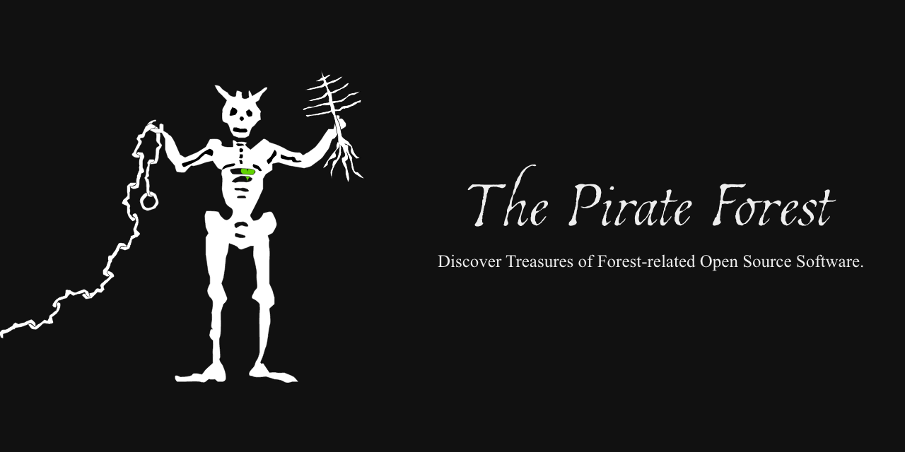

# The Pirate Forest
Discover Treasures of Forest-related Open Source Software.

## Motivation
You actually wanted to be a pirate, but then you became a forester?

I built [The Pirate Forest](https://b-lack.github.io/ThePirateForest/) to get an overview of current forest specific open source software. There you can store, sort and manage your favorite repositories.
  
## Contribute
Send me a message in a bottle or create an [issue](https://github.com/b-lack/ThePirateForest/issues) with links to the repositories you miss in the collection.

## Contributors

  
## Credits
Thanks go to all the pirates listed on thepirateforest.

Consider recognizing their work with a star.
  
## License
MIT © [b-lack](https://github.com/b-lack)
